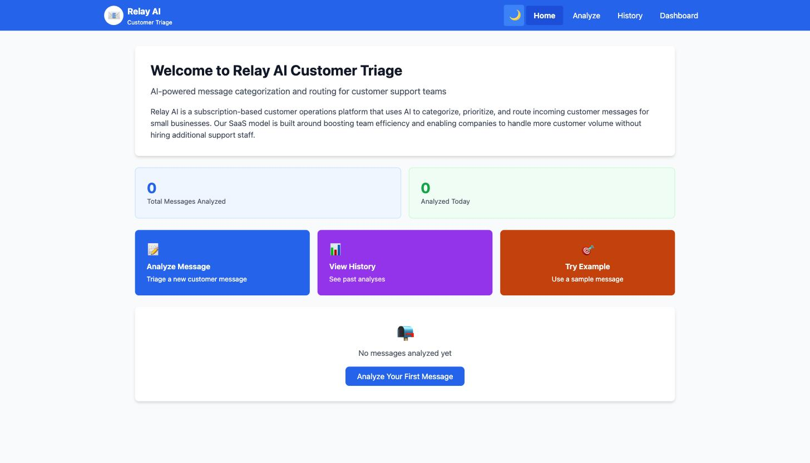

# Customer Inbox Triage App

[](https://github.com/hirekarl/l2assessment/actions/workflows/ci.yml) [](https://codecov.io/gh/hirekarl/l2assessment) [](LICENSE) 

Maintained by [Karl Johnson](https://github.com/hirekarl). See [CONTRIBUTING.md](CONTRIBUTING.md) for the dev workflow, [SECURITY.md](SECURITY.md) to report a vulnerability, and [CHANGELOG.md](CHANGELOG.md) for release history.

## Overview

An AI-powered triage tool that classifies incoming customer support messages, assesses urgency, and recommends a routing action — all in a single LLM call. Built for Relay AI, a SaaS customer operations platform.



## Tech Stack

- **Frontend**: React 19 + TypeScript + Vite + Tailwind CSS
- **Backend**: Vercel serverless function (`api/categorize.ts`)
- **AI**: Groq API (Llama 3.3 70B)
- **Deployment**: Vercel
- **Observability**: Rollbar (error tracking, backend + frontend); structured JSON logging via `console` for anything Rollbar doesn't need to page on
- **Testing**: Vitest + React Testing Library (unit/component, 100% coverage), Playwright + axe-core (E2E + accessibility)
- **Documentation**: TypeDoc (JSDoc comments → static HTML in `docs/api`)

## Setup

### Prerequisites

- Node.js v20+
- npm
- A free Groq API key from [console.groq.com](https://console.groq.com)
- [Vercel CLI](https://vercel.com/docs/cli) (`npm i -g vercel`, or use `npx vercel`)

### Installation

```bash
git clone https://github.com/hirekarl/l2assessment.git
cd l2assessment
npm install
```

Create `.env.local` in the project root:

```env
GROQ_API_KEY=gsk_your-actual-key-here
```

(Rollbar error reporting — `ROLLBAR_SERVER_ACCESS_TOKEN` / `VITE_ROLLBAR_CLIENT_TOKEN` — is configured as Production-only env vars in Vercel, not `.env.local`. Locally and in CI those tokens are unset, so `logEvent`/`reportError` no-op and nothing is sent to Rollbar; no local setup needed.)

Run the full stack (frontend + the `/api/categorize` serverless function):

```bash
npm run dev:full
```

App runs at `http://localhost:3000`. (`npm run dev` alone starts only the Vite frontend — the AI endpoint needs `vercel dev`, which `dev:full` runs.)

### Scripts

| Command                 | Purpose                                                   |
| ----------------------- | --------------------------------------------------------- |
| `npm run dev`           | Vite frontend only (no `/api` route; falls back to mock)  |
| `npm run dev:full`      | Frontend + `/api/categorize` via `vercel dev`             |
| `npm run typecheck`     | TypeScript type checking (`tsc --noEmit`)                 |
| `npm run build`         | Production build                                          |
| `npm run preview`       | Preview the production build                              |
| `npm run lint`          | ESLint (`@typescript-eslint` flat config)                 |
| `npm run format`        | Prettier, write mode                                      |
| `npm run format:check`  | Prettier, check mode (used in CI via lint-staged locally) |
| `npm test`              | Vitest unit/component suite                               |
| `npm run test:coverage` | Vitest with coverage report (100% threshold)              |
| `npm run test:e2e`      | Playwright E2E + accessibility suite                      |
| `npm run docs`          | Generate TypeDoc API documentation into `docs/api`        |

## How It Works

A customer message is submitted and analyzed in two steps:

1. **LLM classification** — A structured prompt asks the Llama 3.3 70B model to return a JSON object with `reasoning`, `category`, and `urgency`. Temperature is set to 0.2 for consistent output. If the response fails to parse or validate, the request is retried once with a corrective note before falling back to a local mock classifier.
2. **Template routing** — The category and urgency are mapped to a recommended action. High-urgency messages get escalation-specific instructions; the UI surfaces an escalation banner for immediate visibility.

Results are saved to `localStorage` and viewable in the History tab, sorted newest-first.

### Categories

| Category          | Description                                         |
| ----------------- | --------------------------------------------------- |
| Billing Issue     | Payments, charges, invoices, refunds, cancellations |
| Technical Problem | Bugs, errors, outages, slow performance             |
| Feature Request   | Suggestions for new or improved functionality       |
| General Inquiry   | How-to questions, account info, general feedback    |

### Urgency Levels

| Level  | Signals                                                                                 |
| ------ | --------------------------------------------------------------------------------------- |
| High   | Service down, data loss, fraud, words like "ASAP" / "immediately", ALL CAPS frustration |
| Medium | Genuine issue, not an emergency                                                         |
| Low    | Casual question, positive feedback, future suggestion                                   |

High-urgency messages trigger an escalation banner and receive urgency-specific routing instructions instead of the standard template.

## Improvements Made (TypeScript & TypeDoc Refactor)

The application has been fully refactored to **React TypeScript** to improve maintainability, developer ergonomics, and type safety across the domain model.

### 1. Strongly Typed Domain Architecture (`src/types/triage.ts`)

- Centralized domain interfaces (`Category`, `Urgency`, `SourceType`, `MockReason`, `CategorizationResult`, `TriageResult`, `TriageHistoryItem`, `DashboardStats`) to enforce strict type contracts across custom hooks, components, pages, and API handlers.

### 2. Full React TypeScript Migration

- Converted all frontend components, hooks, contexts, pages, shared utilities, and the Vercel serverless API route (`api/categorize.ts`) from JavaScript (`.js`/`.jsx`) to TypeScript (`.ts`/`.tsx`).
- Integrated `typescript-eslint` flat configuration into ESLint for linting `.ts` and `.tsx` files.

### 4. Enterprise Excellence Overhaul

- **React Error Boundary & Code Splitting**: Added `<ErrorBoundary>` ([src/components/shared/ErrorBoundary.tsx](file:///D:/dev/pursuit/l2/l2assessment/src/components/shared/ErrorBoundary.tsx)) and `React.lazy` + `Suspense` in [src/App.tsx](file:///D:/dev/pursuit/l2/l2assessment/src/App.tsx) for component crash resilience and dynamic route-based bundle splitting.
- **Runtime Zod Validation**: Added Zod schemas (`CategorizationResultSchema`) in [shared/categorization.ts](file:///D:/dev/pursuit/l2/l2assessment/shared/categorization.ts) to validate API request payloads and AI response structures at runtime.
- **Security & Headers**: Implemented HTTP security headers (`X-Content-Type-Options`, `X-Frame-Options`, `Referrer-Policy`) in [api/categorize.ts](file:///D:/dev/pursuit/l2/l2assessment/api/categorize.ts) and [vercel.json](file:///D:/dev/pursuit/l2/l2assessment/vercel.json).
- **TypeScript Path Aliases**: Configured `@/*` and `@shared/*` path resolution in [tsconfig.json](file:///D:/dev/pursuit/l2/l2assessment/tsconfig.json) and [vite.config.js](file:///D:/dev/pursuit/l2/l2assessment/vite.config.js).
- **Multi-Browser & Visual E2E**: Configured Chromium, Firefox, and WebKit test matrix with visual snapshot regression testing in [playwright.config.js](file:///D:/dev/pursuit/l2/l2assessment/playwright.config.js) and [e2e/visual.spec.js](file:///D:/dev/pursuit/l2/l2assessment/e2e/visual.spec.js).
- **Architecture Decision Records (ADRs)**: Documented architectural choices in `docs/adr/`.

### 5. TypeDoc Documentation Generation (`npm run docs`)

- Transitioned documentation generation from `jsdoc` to **TypeDoc** (`typedoc.json`).
- All existing JSDoc comment blocks (`@param`, `@returns`, `@description`) on functions and components are natively extracted alongside TypeScript signatures into browsable static HTML documentation in `docs/api`.

### 4. Updated Claude Code Automation Hooks

- Extended `.claude/hooks/format-js.sh`, `.claude/hooks/missing-test-file.sh`, and `.claude/hooks/stop-gate.sh` to support `.ts`/`.tsx` files and automatically run `npm run typecheck` before turn completion.

## Improvements Made (Week 2 Assessment)

The original codebase had several bugs that made the triage output unreliable. Below is a summary of what was found and fixed.

### 1. LLM integration was fragile (`llmHelper.ts`)

**Before:** No system prompt. The model responded in free text and the app extracted a category by scanning the response for words like "billing" or "technical". Temperature was 0.7, making results inconsistent. Urgency was not assessed by the LLM at all.

**After:** A system prompt defines the four categories, urgency rules, and required JSON output format. The model returns `{ category, urgency, reasoning }` in a single call. Temperature lowered to 0.2. JSON is validated against the allowed value sets before use.

### 2. Urgency scorer had inverted logic (`urgencyScorer.ts`)

**Before:** A rule-based heuristic scored messages on a 0–100 scale. ALL CAPS _decreased_ urgency by 50 points. Off-hours and weekends also _decreased_ urgency. Polite language like "please" deducted 15 points per word. A message like "PLEASE FIX THIS IMMEDIATELY" would score Low.

**After:** Urgency is assessed by the LLM using the context of the full message. The heuristic scorer is no longer used. `urgencyScorer.ts` remains in the repo (with test coverage documenting its buggy behavior) but is not imported.

### 3. Templates had a copy-paste bug and dead logic (`templates.ts`)

**Before:** `"Feature Request"` was mapped to `"Ask user to check billing portal."` — an exact copy of the Billing Issue action. `shouldEscalate()` ignored its `category` and `urgency` parameters and returned `true` for any message over 100 characters. `getRecommendedAction()` accepted an `urgency` argument but never used it.

**After:** Each category has a correct, distinct recommended action. High-urgency messages receive escalation-specific overrides. `shouldEscalate()` returns `true` for High urgency, or Medium urgency on a Billing Issue. `getRecommendedAction()` uses urgency to select the right action.

### 4. History sorted alphabetically by message text (`HistoryPage.tsx`)

**Before:** `history.sort((a, b) => a.message.localeCompare(b.message))` — sorted A–Z by message content.

**After:** Sorted newest-first by timestamp: `sort((a, b) => new Date(b.timestamp) - new Date(a.timestamp))`.

## Improvements Made (Week 8 Assessment)

This pass focused on the biggest remaining trust gap — a silent AI failure mode — plus hardening the app into something closer to production-grade.

### 1. Silent LLM-to-mock fallback with no user-facing indicator

**Problem:** Relay AI's entire value proposition is AI-driven triage, but the app had no way to tell whether a result came from the real LLM or the keyword-based mock fallback. A bad/expired API key, rate limit, or network blip would silently degrade every subsequent triage to a much dumber heuristic, with support staff none the wiser.

**Fix:** `categorizeMessage` now returns a `source: 'llm' | 'mock'` field plus a short `mockReason` (Missing/Invalid API key, Rate limit exceeded, Network error, AI service error, Invalid response format). The Analyze page shows a green "✓ AI-analyzed" or amber "⚠ Fallback Mode (reason)" banner on every result; History flags fallback-sourced entries with a badge; Dashboard surfaces a count of how many triages ran in fallback mode. `api/categorize.ts` also distinguishes this at the HTTP layer: a real LLM result returns `200`, while a provider failure returns `502` with the same mock body — so uptime monitoring can see AI-provider outages without parsing the response.

A related bug found while building this: the Groq client was constructed at module scope, so a missing API key crashed the app on load instead of falling back gracefully — fixed by lazily constructing the client inside the try block.

### 2. Client-side API key exposure

**Problem:** The Groq API key was shipped to the browser via `dangerouslyAllowBrowser: true`, exposing it to anyone who opened DevTools.

**Fix:** Groq calls moved to a Vercel serverless function (`api/categorize.ts`). The key is read from a server-only `GROQ_API_KEY` env var (not `VITE_`-prefixed) and never bundled into the client. The frontend's `llmHelper.ts` now calls `/api/categorize` and only falls back to a local mock if that endpoint itself is unreachable.

### 3. No automated tests

**Fix:** Added a Vitest + React Testing Library suite (100% statement/branch/function/line coverage) and a Playwright E2E suite covering navigation, the analyze → history flow, dark mode, and an axe-core accessibility scan of every route (which caught and led to fixing a missing `<main>` landmark and several WCAG AA color-contrast failures).

### 4. SOLID-principles refactor

`AnalyzePage`, `HistoryPage`, and `DashboardPage` each mixed data access, business logic, and rendering in one component. Extracted single-purpose hooks (`useTriageHistory`, `useAnalyzeMessage`, `useDashboardStats`) and presentational components per page, so each piece has one reason to change.

### 5. No CI gate on production deployments

**Problem:** Vercel's git integration auto-deployed any push to `main` straight to production, even if CI (lint, tests, build, E2E) hadn't finished or had failed — a red pipeline didn't stop a bad deploy.

**Fix:** Disabled Vercel's automatic git-triggered builds (`git.deploymentEnabled: false` in `vercel.json`) and added a `deploy` job to `.github/workflows/ci.yml` that only runs after both the `lint-test-build` and `e2e` jobs succeed, and only `if: github.event_name == 'push' && github.ref == 'refs/heads/main'`. Production now only deploys from a fully green `main` push — never a PR or a failing run.

### 6. No retry on a bad LLM response, no prompt hardening

**Problem:** Groq's JSON mode plus Zod validation already guarantee a well-typed response most of the time, but a single malformed or unparseable completion dropped straight to the local mock — no second attempt at the real model first. Separately, `SYSTEM_PROMPT` had no defense against a customer message trying to smuggle instructions to the classifier, and its example JSON asked for `category`/`urgency` before `reasoning`, letting the model commit to an answer before explaining it.

**Fix:** `api/categorize.ts` now retries the Groq call once (with a corrective system message) when the response fails to parse or validate, before falling back to the mock; Groq API-level failures (auth, rate limit, network, missing key) still fall back immediately at the app level, unretried — though the Groq SDK client (configured with an explicit `timeout`/`maxRetries`) already retries transient network/429/5xx errors internally before the app ever sees them. `SYSTEM_PROMPT` (`shared/categorization.ts`) now instructs the model to treat the customer message strictly as data, lists `reasoning` first in the required JSON shape, and adds guidance for messages that plausibly span two categories (e.g. a bug-driven cancellation).

### 7. Other polish

- CI (GitHub Actions): lint, test with coverage, build, and E2E on every push/PR.
- Codecov coverage reporting and badge.
- Dark mode toggle (system-preference default, persisted).
- Favicon matching the header's brand mark.
- Dependabot for npm and GitHub Actions.
- Prettier + markdownlint, wired into a Husky pre-commit hook via lint-staged.
- `engines` field pinning the Node version Vite requires.
- TypeDoc static HTML API documentation (`docs/api`).

## Dependency & Security Maintenance

A pass through the open Dependabot backlog, prompted by five open PRs (four GitHub Actions bumps, one large grouped npm bump) sitting unmerged.

### Dependabot backlog cleared

- Merged four clean GitHub Actions major-version bumps (`actions/checkout`, `actions/setup-node`, `actions/upload-artifact`, `codecov/codecov-action`) — CI was already green on each.
- The grouped npm PR (14 updates) failed CI because it bundled `tailwindcss` 3→4, a breaking rewrite, alongside 13 unrelated safe updates. Rather than close it, migrated the app to Tailwind v4 (`@tailwindcss/postcss`, CSS-based config via `@import "tailwindcss"` + `@custom-variant dark`, dropped `tailwind.config.cjs`) and merged the whole group.
- Split `.github/dependabot.yml`'s npm group so it only bundles minor/patch updates going forward — major bumps now get their own individually reviewable PR, preventing this bundling problem from recurring.

### Two high-severity `npm audit` findings fixed

**js-yaml ReDoS ([GHSA-pm4m-ph32-ghv5](https://github.com/advisories/GHSA-pm4m-ph32-ghv5)):** `markdownlint-cli2` pinned its transitive `js-yaml` dependency to the exact vulnerable `5.2.1`. Forced resolution to the patched `5.2.2` via an npm `overrides` entry (a pure internal parser fix, no API changes).

**React Router CSRF bypass ([GHSA-qwww-vcr4-c8h2](https://github.com/advisories/GHSA-qwww-vcr4-c8h2)):** `react-router-dom` was stuck at `7.18.1`, inside the vulnerable range; the fix shipped in `react-router` 8.3.0, which `react-router-dom` never received. Migrated off `react-router-dom` onto `react-router` v8 directly — its main package export already covers everything the app uses (`BrowserRouter`, `Routes`, `Route`, `Link`, `useLocation`, `MemoryRouter`), so this was an import-path change, not an API rewrite. (This app doesn't exercise the vulnerable RSC code path either way, but `react-router-dom` won't receive further security patches.)

`npm audit` now reports zero vulnerabilities.

## Security Note

Groq calls are made server-side, from a Vercel serverless function (`api/categorize.ts`). `GROQ_API_KEY` is read from the server environment only and is never bundled into the browser build — the frontend calls `/api/categorize` and never sees the key.

To report a vulnerability, see [SECURITY.md](SECURITY.md).

## License

[MIT](LICENSE)
